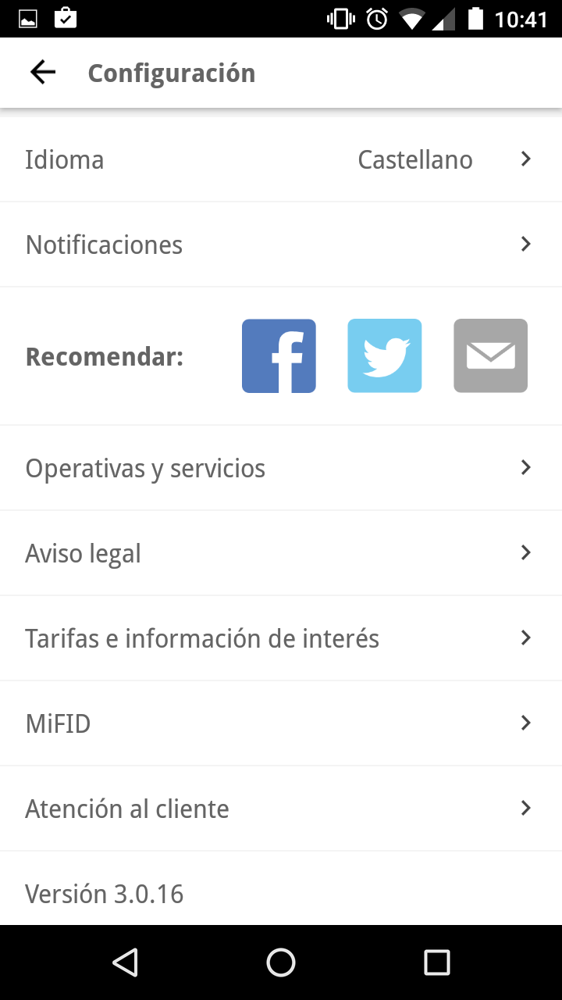
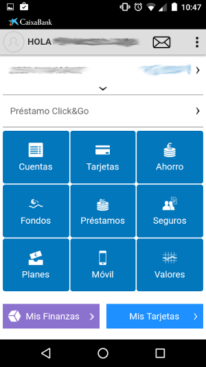
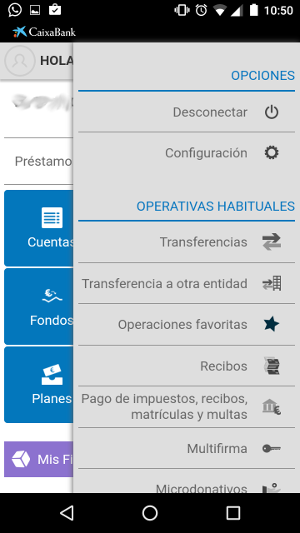
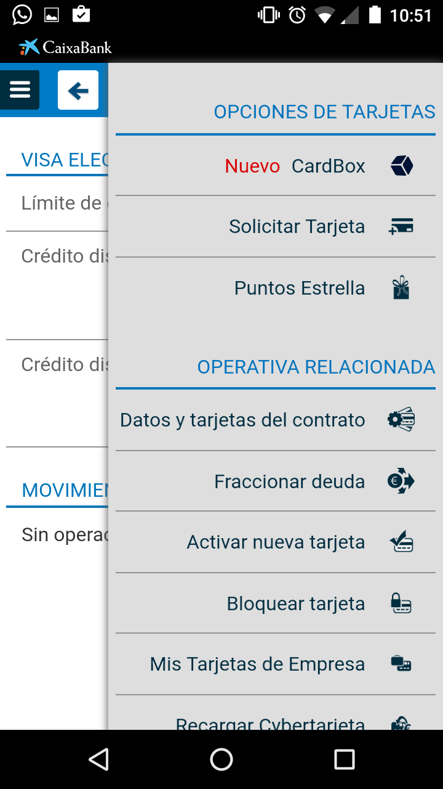
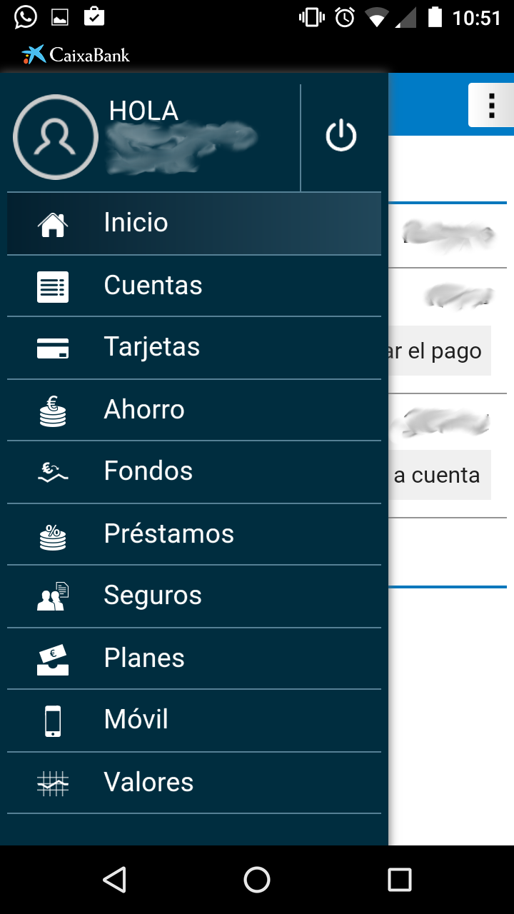
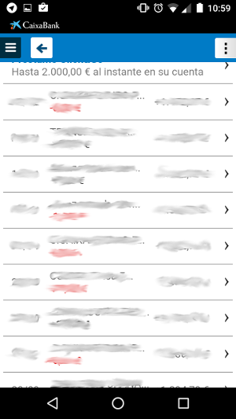
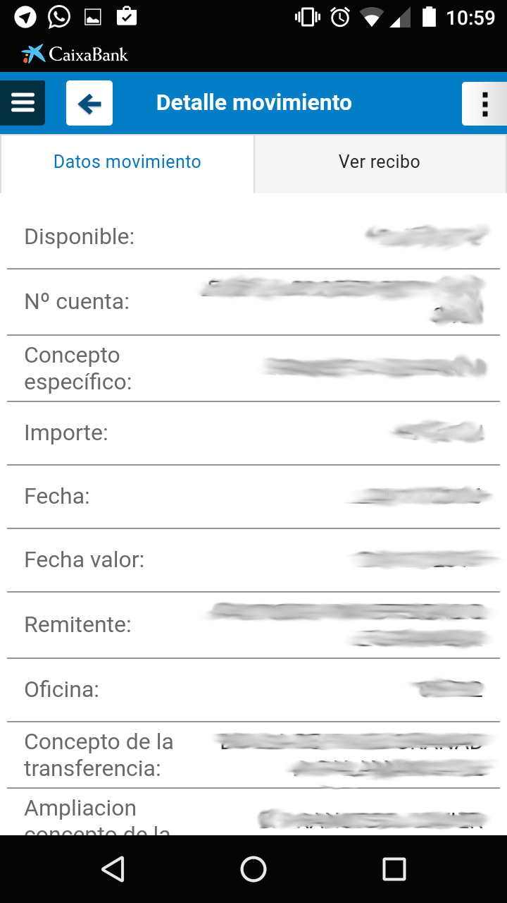

# DES - Analizar la APP de un banco

> Francisco Javier Bolívar Lupiáñez

**Usar la aplicación móvil que tenga tu banco y analízala desde el punto de vista de la estructura y la navegación.**
* **Tipo de aplicación.**
* **La información (jerarquía, categorías, detalle…) que muestra.**
* **Estructuras de navegación usadas. (Incluir capturas de pantalla en el análisis y si consideras que se podría mejorar, indicar cómo, realizar bocetos de pantalla…)**

En la pantalla de inicio, se muestra un menú inicial *springboard*:

Tiene un *Action Bar* con una acción para ir a la pantalla de notificaciones y un *Navigation Drawer*:

Una vez se entra a línea abierta se tiene también otro menú inicial *springboard*:

Y lo que parecen opciones en un *Action Bar* realmente es una especie de *Navigation Drawer*:

Esto se podría mejorar usándolo como propone Android, colocándolo a la izquierda de la pantalla, para no liar a los usuarios.

Una vez se entra en alguna sección, por ejemplo "Tarjetas" pasamos a tener el *Navigation Drawer* clásico a la izquierda, pero manteniendo el otro de la derecha también. Lo que me hace pensar que se podría cambiar simplemente por un "Más opciones" del *Action Bar*:

En la sección de "Cuentas", los elementos aparecen en una lista:

Pinchando en un elemento se entra en el detalle presentándose una vista por tabs:

