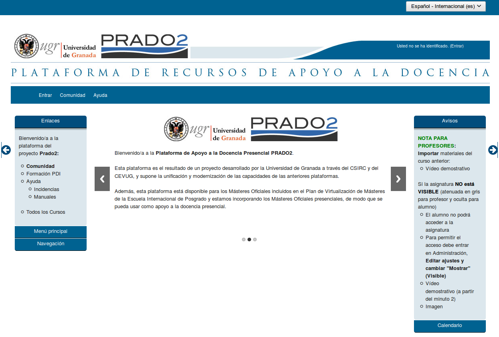
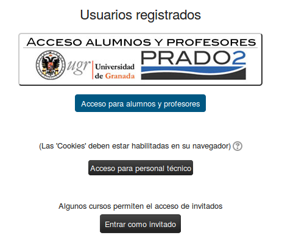
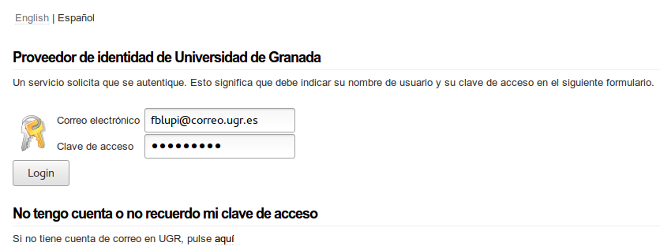
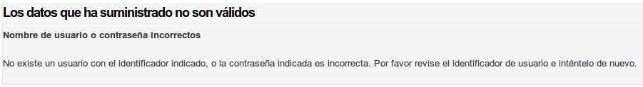
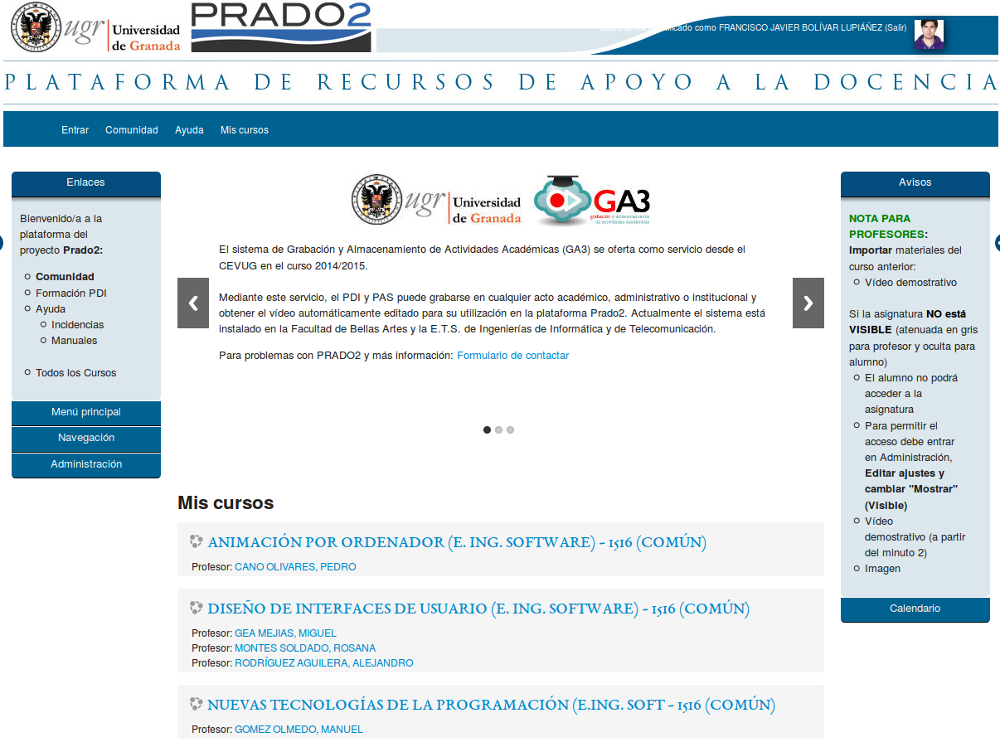
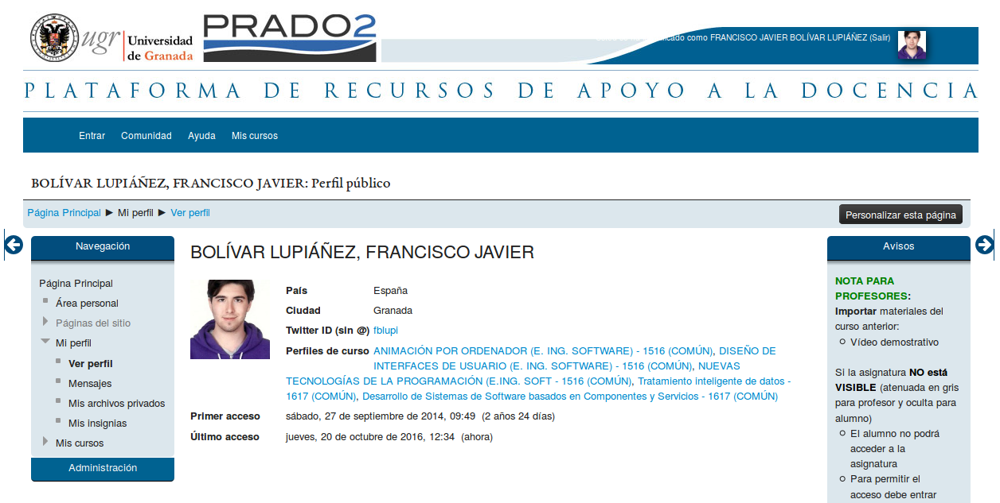
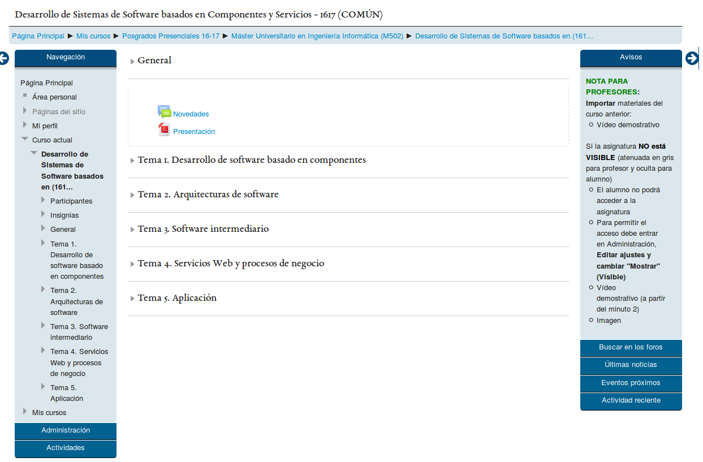
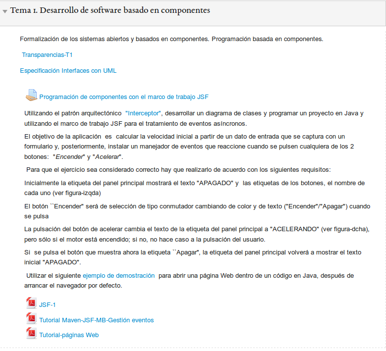

# DES - Evaluación Heurística

> Francisco Javier Bolívar Lupiáñez

**Realizar una evaluación heurística aplicando *las reglas de Nielsen* de una página web. Entregar un documento (Informe del análisis de usabilidad donde aparezcan): problemas detectados, importancia y frecuencia y solución propuesta**

#### Informe del análisis de usabilidad de Prado2

##### Introducción

La UGR está intentando implantar [Prado2](prado.ugr.es/moodle/) como plataforma docente oficial y la mayoría de las asignaturas están dejando otras plataformas como SWAD para usarla. Esto provocó un revuelo entre el alumnado con una idea generalizada de que Prado2 no era una web usable.

En este documento se realizará una evaluación heurística de la web para ver si es cierto eso de que la web no es lo suficientemente usable.

##### Evaluación heurística

###### Inicio de sesión

Lo primero que tiene que hacer el usuario es iniciar sesión. Para ello desde la página de bienvenida (Figura 1) ha de hacer click en *Entrar*. Esta opción está colocada de forma visible en la barra superior a la derecha donde suele estar en otras webs. No obstante hay que pasar por otras dos páginas (Figuras 2 y 3) para realizar el *login*. Lo cual puede resultar tedioso.

Figura 1: Página de bienvenida

Figura 2: Primera página de login

Figura 3: Segunda página de login

Cuando falla el login (Figura 4) se devuelve un mensaje de error entendible al usuario:

Figura 4: Login fallido

###### Página de bienvenida y modificación de perfil

Nada más entrar en la página de bienvenida (Figura 5) se muestra una barra superior con cuatro botones de los cuales uno puede resultar confuso. Hablo del botón *Entrar* ¿es qué ya no estamos dentro identificados? Pruebo a ver qué acción se produce y no produce nada nuevo.

Figura 5: Página principal

Además las asignaturas están en un segundo plano pues hay un carrusel con la misma información que había en el menú de entrada cuando no se estaba identificado. Información que resulta prescindible para el alumnado que tiene que hacer scroll para acceder a los contenidos que realmente le importan: las asignaturas.

Para cambiar el perfil he probado pulsando en mi foto de perfil. Esto me lleva a otra página (Figura 6) donde la única opción que veo de personalizar es un botón que pone *Personalizar esta página*, pero no funciona para lo esperado pues edita la composición de la página y no el propio perfil.

Figura 6: Mi perfil

Después de un rato he descubierto que se edita accediendo al panel de administración que hay en la barra de la derecha

###### Operaciones con asignaturas

He accedido a una asignatura (Figura 7) para realizar las acciones habituales. Descargar temario y realizar una entrega etc. En primer luegar está organizada por temas (aunque esto es algo que puede decidir el profesor) y en cada tema se pueden ver sus archivos descargables y entregas diferenciándose claramente al hacer uso de metáforas en los iconos (Figura 8).

Figura 7: Página principal asignatura

Figura 8: Tema de una asignatura

No obstante, si tengo que descargar todo el material de la asignatura tardo demasiado tiempo navegando de un lado a otro.

##### Conclusiones

Para concluir voy a seguir las reglas de Nielsen:

1. Visibilidad del estado del sistema: Siempre aparece una barra de navegación en la que informa dónde se encuentra.

2. Adecuación del lenguaje: Usa un lenguaje adaptado para el estudiante.

3. Control y libertad del usuario: A la hora de realizar una subida en una práctica hay restricciones. No obstante deja al usuario editar la entrega.

4. Consistencia y estándares: Se han descubierto botones que no son lo que el usuario podría pensar que eran, llegando a poder confundirlo.

5. Prevención de errores: El mensaje de error mostrado (al fallar en el login) presenta adecuandamente el error.

6. Reconocimiento más que memoria: El usuario aquí tiene que usar más la memoria para ver dónde llegar a algunos sitios. Por ejemplo se ha visto al editar perfil que no es todo lo intuitivo que se podría desear.

7. Flexibilidad y eficiencia de uso: Hay acciones que resultan tediosas y largas (descargar toda la documentación de una asignatura, iniciar sesión usando más de una página...)

8. Diálogo estético y diseño minimalista: La web está cargada de menús que apenas se usan y la hacen demasiado compleja.

9. Soporte a los usuarios para reconocimiento, diagnosis y recuperación de errores: El único error mostrado (al fallar el login) presenta adecuandamente el error.

10. Ayuda y documentación: Siempre hay accesible un botón *Ayuda* que lleva a una web con la documentación del sistema.
