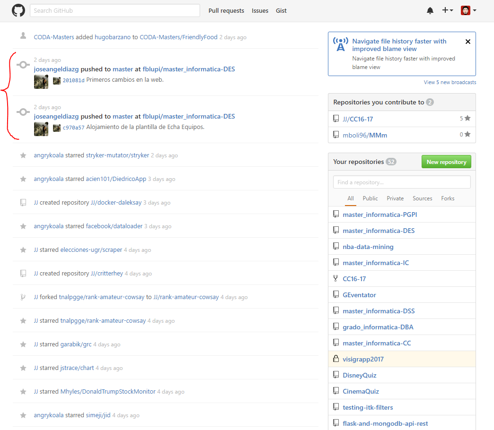
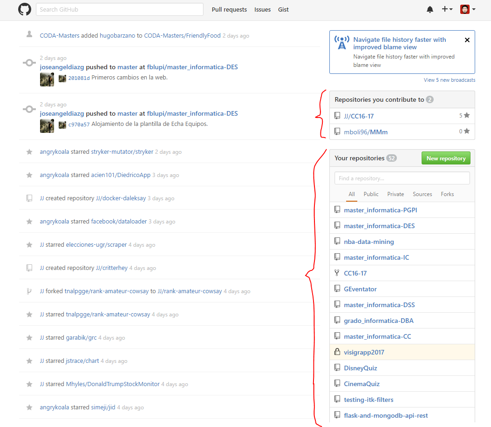
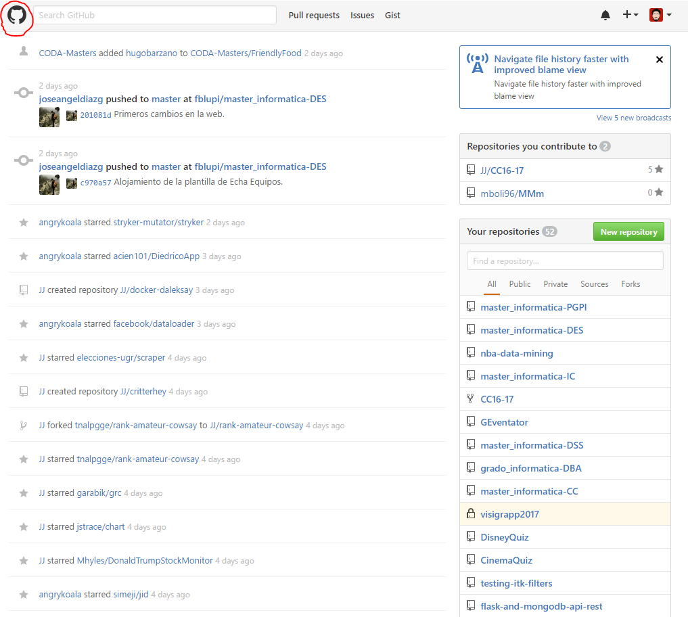
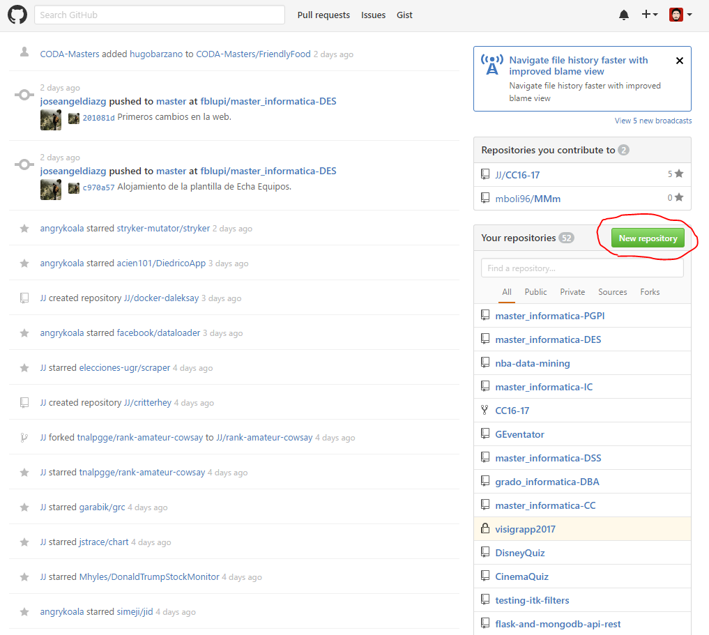

# DES - Leyes de Gestalt

> Francisco Javier Bolívar Lupiáñez

**Analizar una página web o una aplicación móvil para ver si se han seguido las "leyes de gestalt" y poner ejemplos de su uso en ella**

El análisis se ha hecho de la página de bienvenida cuando el usuario se identifica en GitHub: https://github.com/

##### Similitud

Las contribuciones en tus propios proyectos aparecen distintos en la lista de notificaciones de seguidores ya que incluyen el avatar de quien ha realizado la contribución:

##### Proximidad

Tus propios repositorios y en los que se han colaborado se encuentran en un mismo sitio por lo que es fácil identificarlo:

##### Clausura

El logo no está cerrado del todo pero nos hace ver a un gato:

##### Continuidad/Conectividad

La web es tan simple que no se encuentra ningún caso de continuidad/conectividad.

##### Punto focal

Hay elementos diferenciados como el de crear nuevo repositorio:

##### Figura-Fondo

En este caso el fondo es blanco por lo que es más sencillo aún diferenciarlo.

##### Destino común

La web es tan simple que no se encuentra ningún caso de destino común.
