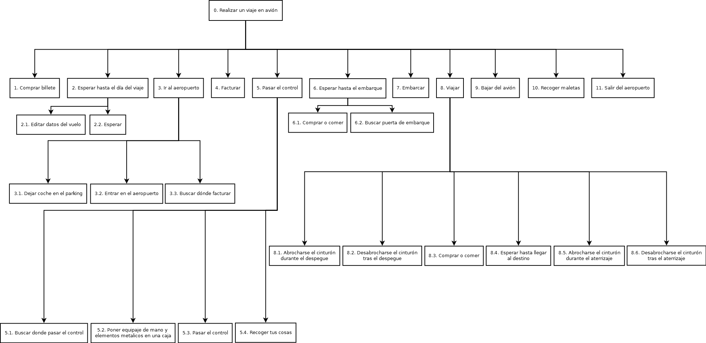

# DES - HTA Vuelo

> Francisco Javier Bolívar Lupiáñez

**Crear un modelo de tareas (usando HTA) para la actividad de "realizar un viaje en avión" (buscar roles, objetivos, tareas y subtareas, objetos, planes,...) (Puede ayudar pensar algunos escenarios de uso concretos). Realizar una descripción del proceso completo usando un diagrama HTA.**

* Plan 0: Hacer 1, 2, 3, 5, 6, 7, 8, 9, 11 en orden. (4 y 10 son opcionales si se tiene equipaje para facturar).
* Plan 2: Hacer 2.2. (2.1 es opcional si en los datos del vuelo hay algún fallo).
* Plan 3: Hacer 3.2. (3.1 es opcional si se viaja en coche al aeroupuerto. 3.3 es opcional si se tiene equipaje para facturar).
* Plan 5: Hacer 5.1, 5.2, 5.3 y 5.4 en orden.
* Plan 6: Hacer 6.2. (5.1 es opcional).
* Plan 8: Hacer 8.1, 8.2, 8.4, 8.5 y 8.6 en orden. (8.3 es opcional).
